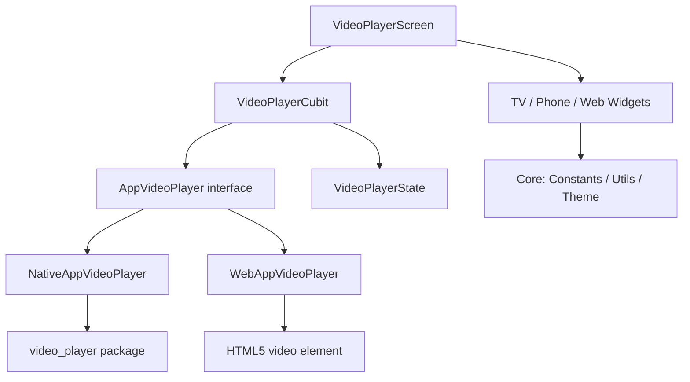

# Clean Architecture Implementation

This project follows a modular **Clean Architecture** pattern, optimized for Flutter and the BLoC/Cubit state management library.

---

## Layers

### 1. Presentation Layer (`lib/features/video_player/`)
- **Cubit**: `VideoPlayerCubit` manages all player state — playback, position, controls visibility, and speed.
- **Widgets**: Atomic and composite UI components (`TvControls`, `PhoneControls`, `SeekBar`, `TvFocusButton`, `WebTvVideoLayout`, `WebVideoSurface`, etc.).
- **Screens**: `VideoPlayerScreen` — the top-level route, owns the `BlocProvider`.
- **Localization**: UI strings are pulled from `AppStrings` (backed by `EasyLocalization`) allowing dynamic RTL/LTR switching (English/Arabic).

### 2. Player Abstraction Layer (`lib/features/video_player/player/`)
A dedicated sub-layer isolating all platform-specific video playback details behind a common interface.

| File | Platform | Backend |
|---|---|---|
| `app_video_player.dart` | All | Abstract interface |
| `native_app_video_player.dart` | Android, iOS, macOS, Android TV | `video_player` package |
| `web_app_video_player.dart` | Web (webOS, Tizen, Chrome) | HTML5 `<video>` element |
| `app_video_player_factory_io.dart` | Non-web | Returns native player |
| `app_video_player_factory_web.dart` | Web | Returns web player |

### 3. Core Layer (`lib/core/`)
- **`constants/`**: Centralized design tokens (sizes, colors, strings, durations).
- **`theme/`**: `AppTheme` with dark mode configuration.
- **`utils/`**: Platform detection (`PlatformUtils`) and `DurationExtension`.

---

## Design Patterns

### 1. Bloc/Cubit
`VideoPlayerCubit` is the single source of truth for all player state. The UI never owns state — it only reads from the Cubit and sends events.

### 2. Abstract Player Interface
`AppVideoPlayer` defines the contract. `VideoPlayerCubit` knows nothing about HTML5 `<video>` or the `video_player` package — it only calls `player.play()`, `player.pause()`, etc. Adding a new backend (e.g., ExoPlayer) requires zero changes to the Cubit.

### 3. Conditional Imports (Factory Pattern)
```
app_video_player_factory.dart
  ├── _factory_io.dart   (non-web: NativeAppVideoPlayer)
  └── _factory_web.dart  (web:     WebAppVideoPlayer)
```
Dart's `dart:io` / `dart:html` conditional exports select the correct implementation at compile time with no `if (kIsWeb)` guards in business logic.

### 5. Part/Part-of System
The feature uses `imports.dart` + `part`/`part of` directives for a clean single-import API. Internals stay modular without leaking private symbols.

### 6. Responsive Scaling (`flutter_screenutil`)
- **Phone Design**: 360×690
- **TV Design**: 960×540 (logical pixels on a 1080p TV at 2× density)

`main.dart` passes the correct design size to `ScreenUtilInit` after `PlatformUtils.initialize()` completes.

### 8. Refactored Seek Bar System
To maximize performance on Smart TV browsers, the seek bar was split into specialized components. 
- **Listenable Architecture**: Instead of rebuilding via Bloc, the TV seek bar listens to a `ValueNotifier` in the Cubit. This reduces the message-passing overhead between the JS engine and Flutter to a bare minimum.
- **D-pad Optimized**: Interactive sliders are replaced with linear progress indicators on TV to prevent the "Focus Trapping" common in web-based TV apps.

---

## Dependency Graph



---

## Platform Detection Flow

```
App Startup → PlatformUtils.initialize()
    kIsWeb?           → TV mode  (webOS / Tizen)
    Android?          → MethodChannel → UiModeManager → TV or Phone
    macOS?            → TV mode  (Apple TV proxy)
    Linux?            → TV mode  (flutter-tizen native .tpk)
                      isTizenNative → playback speed UI hidden; TizenSafeVideoPlayerPlatform
    Otherwise         → Phone mode
```
