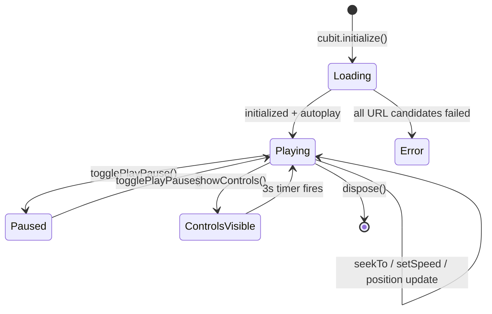

# Feature Flow: Video Player

This document describes the full lifecycle and interaction flow of the video player feature.

---

## 1. Initialization Flow

```
App Start
  └── PlatformUtils.initialize()
        ├── kIsWeb?        → isTV = true  → create WebAppVideoPlayer
        ├── Android?       → MethodChannel → UiModeManager
        │     ├── TV mode  → isTV = true  → create NativeAppVideoPlayer
        │     └── Phone    → isTV = false → create NativeAppVideoPlayer
        ├── macOS / Linux? → isTV = true  → create NativeAppVideoPlayer
        └── Otherwise      → isTV = false → create NativeAppVideoPlayer
  └── main.dart → ScreenUtilInit (tvDesignSize or phoneDesignSize)
  └── VideoPlayerScreen → BlocProvider → VideoPlayerCubit
  └── VideoView built → cubit.initialize() called
```

### Web TV Initialization (WebAppVideoPlayer)
1. `assetUrlCandidates()` builds a prioritized URL list based on `Uri.base.scheme`:
   - `file://` (packaged `.ipk`/`.wgt`): `media/<file>` → `assets/assets/<path>` → ...
   - `http://` (dev/hosted): `assets/assets/<path>` → `assets/<path>` → ... → `media/<file>`
2. `_loadSource(url)` sets `<video>.src`, calls `.load()`, and races `onLoadedMetadata` vs `onError` via a `Completer`.
3. On success: `_syncFromElement()` updates `AppVideoPlayerValue`. 
4. **Polling Timer**: A `500ms` periodic timer starts (instead of `timeupdate`) to update the Cubit's state with minimal pressure.
5. On error: rejects in **milliseconds** → next candidate tried immediately.
6. If all candidates fail: Cubit catches the error and emits an error state.

### Native Initialization (NativeAppVideoPlayer)
1. `VideoPlayerController.asset('assets/videos/sample.mp4')` created.
2. `controller.initialize()` awaited.
3. `controller.addListener()` wires live position/buffering updates to the Cubit.
4. `controller.play()` called — autoplay begins.

---

## 2. Interaction Flow (D-pad & Remote — TV)

| Input | Event | Cubit Action |
|---|---|---|
| D-pad Enter / OK | `ActivateIntent` via `TvFocusButton` Shortcuts | `togglePlayPause()` |
| D-pad Left | `PreviousFocusIntent` (overrides spatial) | Moves focus to Rewind button |
| D-pad Right | `NextFocusIntent` (overrides spatial) | Moves focus to Forward button |
| D-pad Up/Down | `onKeyEvent` in VideoView | `showControls()` — wakes overlay |
| Speed button | `TvControls` cycle (web TV + Android TV) | `setPlaybackSpeed(next)` — **not shown** on native Tizen (`isTizenNative`) |
| Back / Escape | System Back | Default system back behavior |

- **Auto-focus**: On TV, the Play/Pause `TvFocusButton` requests focus automatically.
- **Controls Wake-up**: Any key event resets the `_controlsTimer` and shows the overlay.
- **Seek Bar Updates**: High-frequency updates bypass the Bloc and use `ValueListenableBuilder` to update the UI directly at 60fps.

---

## 3. Interaction Flow (Touch — Mobile)

| Gesture | Trigger | Cubit Action |
|---|---|---|
| Single Tap | `GestureDetector` on `VideoView` | `toggleControls()` |
| Double Tap Left | `GestureDetector` left half | `seekBackward(5s)` + `DoubleTapFeedback` |
| Double Tap Right | `GestureDetector` right half | `seekForward(5s)` + `DoubleTapFeedback` |
| Slider Drag | `SeekBar` `onChanged` | `seekTo(position)` |
| Speed Button | `SpeedSelectorBottomSheet` | `setPlaybackSpeed(x)` |
| Fullscreen | `PhoneControls` icon | `SystemChrome` orientation lock |

---

## 4. Auto-Hide Controls Flow

1. **Show**: Any interaction calls `cubit.showControls()`.
2. **Timer Start**: `_controlsTimer` cancels any existing timer, starts fresh 3-second countdown.
3. **Inactivity**: Timer fires → `showControls` → `false` → `AnimatedOpacity` fades out overlay.
4. **Reset**: Any new interaction repeats from step 1.
5. **TV special**: D-pad key events (Up/Down/Left/Right) detected by `onKeyEvent` in `VideoView` also call `showControls()`.

---

## 5. State Flow Diagram



---

## 6. Error Handling

| Scenario | Handling |
|---|---|
| Web URL 404 | `onError` Completer rejects instantly → next candidate tried |
| All web candidates fail | Exception thrown → Cubit emits `error` state → UI shows error message |
| Native asset missing | `VideoPlayerController.initialize()` throws → Cubit catches → error state |
| App backgrounded | `WidgetsBindingObserver.didChangeAppLifecycleState` → `player.pause()` |
| Web autoplay blocked | `play()` wrapped in `try-catch` → gracefully stays paused |
