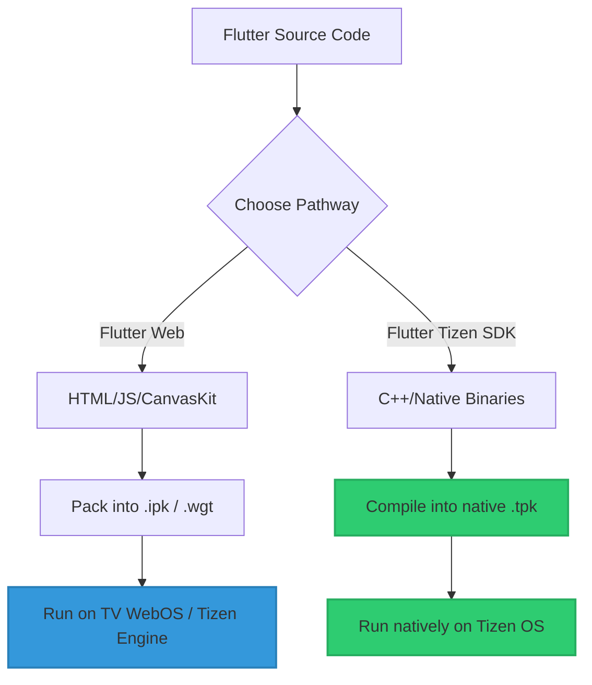

# Smart TV Deployment Handbook: LG webOS & Samsung Tizen

This handbook provides a comprehensive, production-ready guide to building, packaging, deploying, and testing this Flutter-based application on **LG webOS** and **Samsung Tizen** Smart TVs. 

By leveraging **Flutter Web** and **Native Tizen Ports**, you can target millions of living room screens with a single unified codebase.

---

## 📺 1. Platform Deployment Paradigms

Smart TV platforms run on custom Linux distributions with specific application engines:

| Platform | OS | Primary Runtime | Package Format | Dev Toolchain |
| :--- | :--- | :--- | :--- | :--- |
| **LG Smart TV** | **webOS** | Web Engine (Chromium-based) | `.ipk` (webOS Package) | webOS TV CLI (`ares-cli`) |
| **Samsung Smart TV** | **Tizen** | Web Engine (Chromium) / Native | `.wgt` (Web) / `.tpk` (Native) | Tizen Studio CLI / `flutter-tizen` |

---

## 🛠️ 2. LG webOS Deployment (Web App Approach)

LG webOS applications are packaged web pages running in a system-managed Chromium container.

### Step 2.1: Prerequisites
1. Download and install the [webOS TV SDK](https://webostv.developer.lge.com/sdk/installation).
2. Add the `ares-cli` directory to your system's `PATH`.
3. Install the **Developer Mode App** from the LG Content Store on your TV, log in with your LG Developer Account, and enable **Dev Mode** and **Key Server**.

### Step 2.2: Package Configuration (`appinfo.json`)
The `web/appinfo.json` file defines the application metadata for webOS. We have initialized this file in the `web` directory:

```json
{
  "id": "com.multiplatform.videoplayer",
  "version": "1.0.0",
  "vendor": "MohammedHessein",
  "type": "web",
  "main": "index.html",
  "title": "Multi Platform Video Player",
  "icon": "icon.png",
  "largeIcon": "largeIcon.png",
  "resolution": "1920x1080"
}
```

### Step 2.3: Recommended Development Workflow (Hosted Mode)
For the fastest development loop on webOS, use the **Hosted** script. This serves the build directory via a local HTTP server, which is more reliable than the `file://` protocol for some Chromium versions.

```powershell
# Run this script to build, patch, and launch on the webOS emulator automatically
.\scripts\run_webos_hosted.ps1
```

### Step 2.4: Build & Packaging Pipeline (Production .ipk)
Run the following commands to create a standalone package:

```bash
# 1. Compile the Flutter Web build for TV deployment
flutter build web --release --no-web-resources-cdn

# 2. Patch for TV file:// and local CanvasKit
node patch_tv_js.js
node repair_bootstrap.js

# 3. Package the compiled web app into a webOS package (.ipk)
ares-package --no-minify ./build/web
```

### Step 2.5: TV Registration & Deployment
Connect to your physical TV and install the package using `ares`:

```bash
# 1. Register your TV target (replace details with values from the Dev Mode app)
ares-setup-device -a tv_living_room -i "deviceIp=192.168.1.50" -i "port=9922" -i "username=developer"

# 2. Get the Dev Mode SSH key from your TV
ares-novsync -d tv_living_room -key <passphrase_from_dev_mode_app>

# 3. Install the package onto the TV
ares-install -d tv_living_room com.multiplatform.videoplayer_1.0.0_all.ipk

# 4. Launch the application remotely
ares-launch -d tv_living_room com.multiplatform.videoplayer
```

---

## 🛡️ 3. Samsung Tizen Deployment (Web & Native Ports)

Samsung TVs support both standard **W3C Web Widgets** (`.wgt`) and native binaries (`.tpk`) compiled via the Flutter-Tizen engine.

### Option A: Web Packaging Approach (Standard & Highly Recommended)
This packages the Flutter Web build into a Tizen-compatible zip format (`.wgt`) running on the TV's Samsung Web Engine.

#### Step 3.1: Prerequisites
1. Download and install [Tizen Studio](https://developer.tizen.org/development/tizen-studio/download).
2. Set up a **Samsung Developer Security Profile** within the Tizen Certificate Manager to sign your apps.

#### Step 3.2: Package Configuration (`config.xml`)
The `web/config.xml` file governs Tizen-specific platform features, permissions, and profiles. We have configured this at `web/config.xml`:

```xml
<?xml version="1.0" encoding="UTF-8"?>
<widget xmlns="http://www.w3.org/ns/widgets" xmlns:tizen="http://tizen.org/ns/widgets" id="http://tizen.org/MultiPlatformVideoPlayer" version="1.0.0" viewmodes="fullscreen">
    <tizen:application id="tIzeNPlAyR.MultiPlatformVideoPlayer" package="tIzeNPlAyR" required_version="3.0"/>
    <content src="index.html"/>
    <feature name="http://tizen.org/feature/screen.size.all"/>
    <icon src="icon.png"/>
    <name>Multi Platform Video Player</name>
    <tizen:profile name="tv"/>
    <tizen:setting screen-orientation="landscape" context-menu="disable" background-support="disable" encryption="disable"/>
    <tizen:privilege name="http://tizen.org/privilege/internet"/>
</widget>
```

#### Step 3.3: Web Packaging Pipeline
Compile, sign, and build the Tizen package. **Order matters:** patch **before** packaging (patching after signing breaks the signature).

```bash
# 1. Build the Flutter Web bundle for Tizen TV
flutter build web --release --no-web-resources-cdn

# 2. Patch for Smart TV file:// and local CanvasKit (also copies media/sample.mp4)
node patch_tv_js.js

# 3. Ensure Tizen widget metadata is present (Flutter may not copy config.xml on every build)
#    Copy manually if missing: web/config.xml and web/icon.png → build/web/

# 4. Package and sign (use a Tizen certificate profile for generic emulator — see Step 3.4)
tizen package -t wgt -s <tizen_security_profile> -- ./build/web
# Output example: build/web/Multi Platform Video Player.wgt
```

#### Step 3.4: Deploy to Samsung TV or Emulator

**Which emulator?**

| Emulator | Serial example | `.wgt` install | Visible video |
| :--- | :--- | :--- | :--- |
| **`T-10.0-x86_64`** (generic Tizen) | `emulator-26111` | Yes — use **Tizen** cert profile | Yes (HTML5) |
| **`T-samsung-10.0-x86_64`** (Samsung TV) | `emulator-26101` | **No** (`appcmd_support: disabled`) | Use `.tpk` or Chrome for dev |
| **Physical Samsung TV** | `sdb devices` | Yes — **Samsung TV** cert | Yes |

**Certificate profiles:**
- **Samsung TV profile** (e.g. partner cert from Samsung Certificate Manager) → real TV and `.tpk` native builds.
- **Tizen profile** (author + `tizen-distributor-signer`) → generic `T-10.0-x86_64` emulator for `.wgt` testing. Using a Samsung-only cert on the generic emulator fails with certificate error `-12`.

```bash
# 1. List devices (add C:\tizen-studio\tools to PATH if needed)
C:\tizen-studio\tools\sdb.exe devices

# 2. Install (CLI uses -s for serial, not -d)
tizen install -s <device_serial> -n "build/web/Multi Platform Video Player.wgt"

# 3. Launch (tizen run may fail for .wgt; app_launcher is reliable)
C:\tizen-studio\tools\sdb.exe -s <device_serial> shell "app_launcher -s tIzeNPlAyR.MultiPlatformVideoPlayer"
```

**Fastest dev loop (no emulator packaging):**
```bash
flutter run -d chrome
```
Uses the same `WebAppVideoPlayer` as `.wgt`.

---

### Option B: Native Tizen App Approach (Premium Performance)
For native TV rendering and low-level engine efficiency, you can compile to a Tizen native `.tpk` executable.



#### Step 3.5: SDK Integration
1. Install the official community-driven **Flutter-Tizen toolchain**:
   ```bash
   git clone https://github.com/flutter-tizen/flutter-tizen.git
   # Add flutter-tizen/bin to your system PATH
   ```
2. Run `flutter-tizen doctor` to verify correct setup.

#### Step 3.6: Compilation & Signing
Compile code directly into Tizen native binary files:

```bash
# flutter-tizen does NOT support a --web flag; web TV = .wgt pipeline above.

# Run on Samsung TV emulator or device (Samsung TV security profile)
flutter-tizen run -d <device_serial>

# Or build .tpk explicitly:
flutter-tizen build tpk --device-profile=tv --security-profile=<samsung_tv_profile>
flutter-tizen install -d <device_serial>
```

#### Step 3.7: Native `.tpk` — Emulator Limitations (Important)

The [`video_player_tizen`](https://pub.dev/packages/video_player_tizen) plugin states:

> This plugin is **NOT** supported on TV emulators.

**What you may see on `T-samsung-10.0-x86_64`:**
- Black video surface while **seek bar and controls still work** (media pipeline runs; GPU texture does not render).
- `PlatformException: Function not implemented` for `setPlaybackSpeed` / `getPosition` on some emulator builds.

**What the app does:**
- Registers **`TizenSafeVideoPlayerPlatform`** in `main.dart` to swallow unsupported native calls and avoid crashes.
- Hides the **playback speed** button on native Tizen only (`PlatformUtils.isTizenNative`). Speed control remains on Android, iOS, Chrome, and `.wgt` Web TV.

**Where to verify visible video without a physical TV:**
1. `flutter run -d chrome`
2. `.wgt` on `T-10.0-x86_64` (Step 3.4)
3. Physical Samsung TV for final native `.tpk` validation

---

## 🎯 4. Addressing Smart TV Specific Challenges

Smart TV runtimes introduce specific, non-obvious platform challenges. Our app incorporates dedicated design patterns to solve these natively.

### 4.1. D-pad & Remote Control Navigation
TV remotes do not have cursor pointer devices (unless using the LG Magic Remote). Instead, users navigate via **D-pad** keys (Up, Down, Left, Right, Enter).
- **Physical Key Mapping**: TV operating systems map remote controls to standard keyboard keystrokes:
  - **D-pad Enter / Center Click** $\rightarrow$ `LogicalKeyboardKey.select` or `LogicalKeyboardKey.enter`
  - **D-pad Arrows** $\rightarrow$ `LogicalKeyboardKey.arrowUp` / `arrowDown` / `arrowLeft` / `arrowRight`
  - **D-pad Back** $\rightarrow$ `LogicalKeyboardKey.escape` or `LogicalKeyboardKey.goBack`
- **Focus System**: Our UI components utilize `FocusableActionDetector` to seamlessly handle D-pad navigation and visual outline indicators to show the currently focused button on the TV screen.

---

### 4.2. CORS & Network Permissions
By default, standard web browsers enforce Cross-Origin Resource Sharing (CORS). However:
- **webOS**: If packaged as a local file web app (`file://`), webOS removes standard origin constraints. If loaded from an external server, standard CORS rules apply. Ensure video CDNs include `Access-Control-Allow-Origin: *` headers.
- **Tizen**: You must request network privilege access inside `config.xml` to allow external video streaming:
  ```xml
  <tizen:privilege name="http://tizen.org/privilege/internet"/>
  ```

---

### 4.3. Autoplay Constraints & Muted Video Start
Browsers and TV web containers restrict video playback from starting with sound without user interaction.
- **Autoplay Muting Sequence**: When initializing streams on web/TV platforms, the app programmatically mutes the video, calls `.play()`, and then relies on user engagement (remote interaction) to restore full audio, preventing runtime browser exceptions.

---

## 🏆 5. TV Performance Best Practices

To ensure a smooth **60 FPS** performance on standard Smart TV processors (which often run on low-end ARM chipsets):

1. **Isolate Video Surface**: The `WebVideoSurface` widget caches its `HtmlElementView` to prevent the Flutter engine from re-registering the DOM element during UI rebuilds.
2. **Throttle Position Updates**: We use a `500ms` polling timer instead of the high-pressure `timeupdate` event, reducing CPU load significantly on Tizen and webOS.
3. **Optimized Video Attributes**: 
   - `preload = 'none'` prevents aggressive background buffering.
   - `object-fit: fill` avoids expensive CSS compositing.
   - Removed `will-change: transform` to prevent unnecessary layer promotion.
4. **Always Use CanvasKit**: Never build with the `--web-renderer html` flag. CanvasKit utilizes Skia hardware acceleration.
5. **Always Use `--base-href=./`**: Required for `file://` protocol support.
6. **Force Local CanvasKit Loading**: Handled by `patch_tv_js.js` to ensure the app works offline or on restricted TV networks.
7. **Minimize Rebuilds**: Utilize `BlocSelector` and `buildWhen` to keep the UI responsive while video plays.
